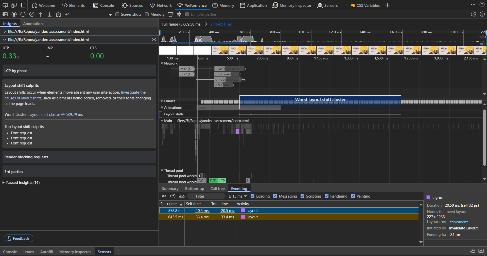
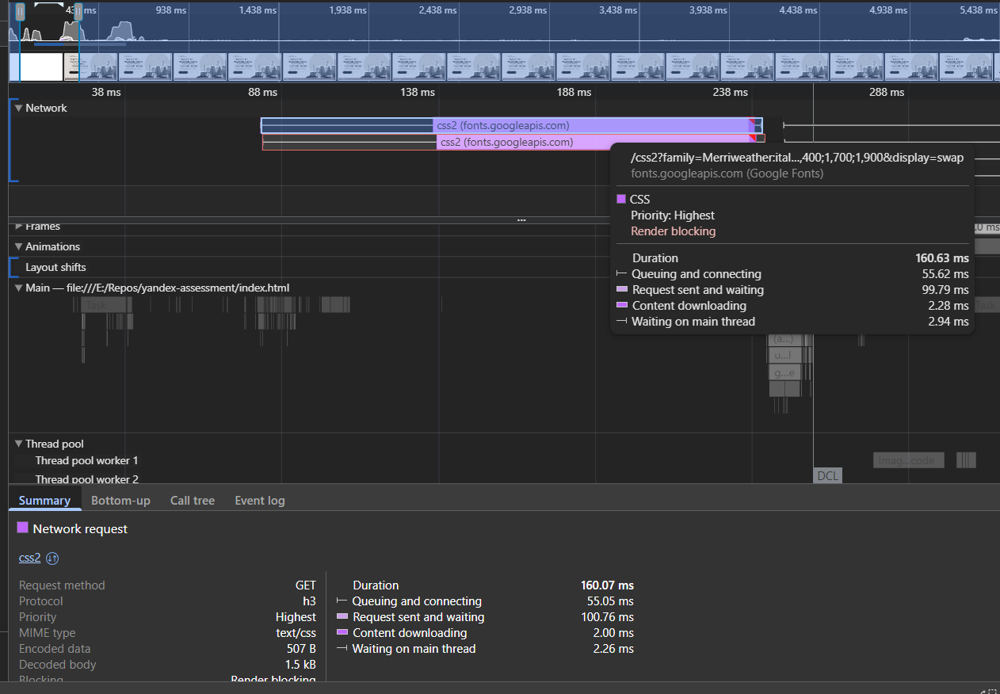

1- the content is Russian, Change it to `<html lang="ru">`
2- BEM - Class names must be in kebab case, So for example `tournament-section__item_description` should be `tournament-section__item-description`, and `tournament-section__item_img` should be `tournament-section__item-img`
3- Generic title that doesn't help with SEO `<title>Document</title>`, do it like that: `<title>Международный Васюкинский Турнир по Шахматам | 22 июня 1927</title>`
4- a- missing meta description tags, b- Missing Open Graph and Twitter Card meta tags for social sharing, c- No robots or viewport meta tags. Add these inside the <head> element:
```html
    <meta name="description" content="Поддержите шахматную мысль и примите участие в Международном васюкинском турнире по шахматам. Сеанс одновременной игры на 160 досках с гроссмейстером О. Бендером.">
    <meta name="keywords" content="шахматный турнир, Васюки, Остап Бендер, сеанс одновременной игры">
    <meta name="robots" content="index, follow">
    <meta name="author" content="К. Михельсон">
    
    <!-- Open Graph Tags -->
    <meta property="og:title" content="Международный Васюкинский Турнир по Шахматам">
    <meta property="og:description" content="Поддержите шахматную мысль и примите участие в Международном васюкинском турнире по шахматам.">
    <meta property="og:type" content="website">
    <meta property="og:url" content="https://vasyuki-chess.example.com">
    <meta property="og:image" content="./assets/img/tournament-section__item-img1.png">
    
    <!-- Twitter Card Tags -->
    <meta name="twitter:card" content="summary_large_image">
    <meta name="twitter:title" content="Международный Васюкинский Турнир по Шахматам">
    <meta name="twitter:description" content="Поддержите шахматную мысль и примите участие в Международном васюкинском турнире по шахматам.">
    <meta name="twitter:image" content="./assets/img/tournament-section__item-img1.png">
    
    <!-- Canonical URL -->
    <link rel="canonical" href="https://vasyuki-chess.example.com">
```
6- Multiple h1 tags on the page (should ideally have only one primary h1).
7- No width and height attributes on images (helps with layout stability)
8- No schema.org markup for the event information, so adding structured data would help search engines understand the content better
```json
<script type="application/ld+json">
{
  "@context": "https://schema.org",
  "@type": "Event",
  "name": "Международный васюкинский турнир по шахматам",
  "startDate": "1927-06-22T18:00",
  "location": {
    "@type": "Place",
    "name": "Клуб «Картонажник»",
    "address": {
      "@type": "PostalAddress",
      "addressLocality": "Васюки"
    }
  },
  "performer": {
    "@type": "Person",
    "name": "О. Бендер"
  },
  "offers": {
    "@type": "Offer",
    "price": "20",
    "priceCurrency": "RUB",
    "availability": "https://schema.org/InStock"
  },
  "description": "Сеанс одновременной игры в шахматы на 160 досках гроссмейстера О. Бендера"
}
</script>
```

9- Consider adding lazy loading for images below the fold: `loading="lazy"`
10- for screen reader users, SEO, and voice recognition software users... we should add discernible text to buttons: aka add a `title` attribute `<button class="btn__prev" title="Предыдущий слайд">` or we could use `aria-label` (e.g.:- `aria-label="Предыдущий слайд"`).
11- add `aria-hidden="true"` on SVGs to prevent screen readers from trying to announce the SVG content.

12- One more thing, from the CSS file I saw that we only used weights 400,500,600, and 700 and we never used any other configuration of the fonts like Italic for example, and we are importing the whole fonts, why? it seems unnecessary

13- from Chrome DevTools Performance audit shows that multiple fonts were late-loading, and at 539.29ms, a "cluster" of layout shifts happened., so Use `<link rel="preload">` in HTML and removing the fonts fetching from CSS:
```html
<!-- Only load weights 400–700, no italics... while solving both LCP and CLS -->
<link rel="preload" href="https://fonts.googleapis.com/css2?family=Golos+Text:wght@400;500;600;700&display=swap" as="style" onload="this.onload=null;this.rel='stylesheet'">
<link rel="preload" href="https://fonts.googleapis.com/css2?family=Merriweather:wght@400;500;600;700&display=swap" as="style" onload="this.onload=null;this.rel='stylesheet'">

<!-- with fallback -->
<noscript>
  <link rel="stylesheet" href="https://fonts.googleapis.com/css2?family=Golos+Text:wght@400;500;600;700&display=swap">
  <link rel="stylesheet" href="https://fonts.googleapis.com/css2?family=Merriweather:wght@400;500;600;700&display=swap">
</noscript>
```

I thought of the previous advice before checking [this website which checks the flash of unstyled text (or FOUC)](https://meowni.ca/font-style-matcher/) and discovered that the fonts and their fallback fonts are not compatible with each other, and Merriweather is taller and wider than Golos, Gill Sans, and Calibri. So, please, Choose other compatible fonts.

14-  because google fonts block rendering until they're downloaded and parsed, and they're in the critical rendering path, delaying LCP.

15- One more thing, from the CSS file I saw that we only used weights 400,500,600, and 700 and we never used any other configuration of the fonts like Italic for example, and we are importing the whole fonts, why? it seems unnecessary

16- Layout shifts before solving the `LCP` and `CLS` issues:


17- Contrast issues got captured with Lighthouse: Low-contrast text is difficult or impossible for many users to read. On the following:
```
- span.total-count
- span.person__status
- p.footer__text
- footer.footer
```
18- Also from Lighthouse: Image display dimensions should match natural aspect ratio on some images, So you should explicitly set correct width and height, or Or set `aspect-ratio` in the CSS rules.

```
- 
- 
```
19- The `integrity` attribute in script and link tags is a security feature that ensures the files your web page loads haven't been tampered with, so I addded `integrity="HASH"` and `crossorigin="anonymous"` attributes to the scripts

20- changed the slider `marquee` animation to be from left to right instead of right to left, for readability