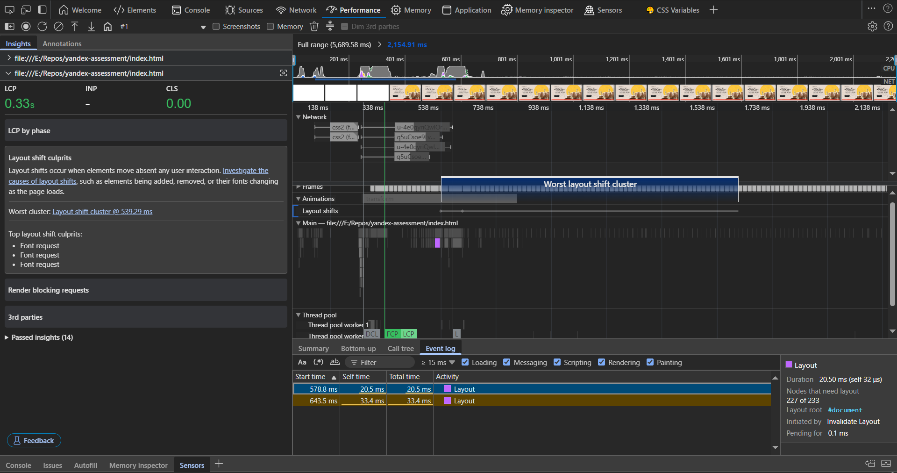
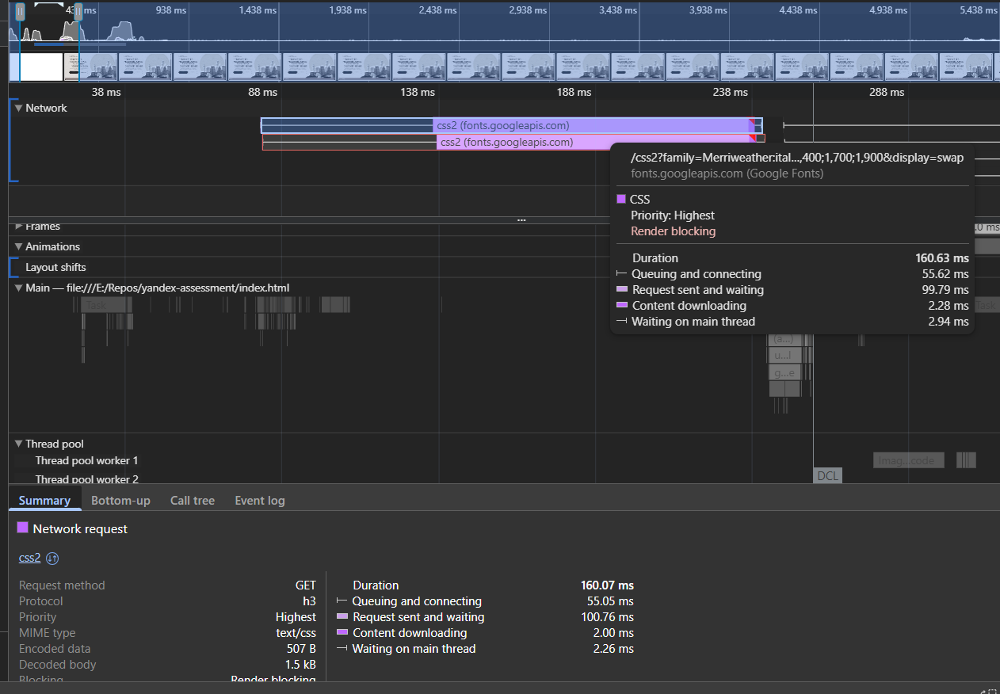

[Deployed on Vercel: Международный васюкинский турнир](https://yandex-assessment.vercel.app/)

## HTML Structure & Semantics

1. I changed the root `html` tag to specify Russian content: `<html lang="ru">`
2. Only **one `<h1>`** per page... then I used proper heading hierarchy (`<h2>`, `<h3>`, etc.) thereafter.
3. Used Semantic HTML tags and ARIA attributes as much as possible, (e.g., `aria-label="Предыдущий слайд"`) and `aria-live="polite"` to dynamic content for screen reader updates:

```html
<div
  class="count-indicator"
  aria-label="Индикатор участников"
  aria-live="polite"
></div>
```

---

## Accessibility (a11y)

10. for screen reader users, SEO, and voice recognition software users... we should add descriptive text to buttons: aka add a `title` attribute `<button class="btn__prev" title="Предыдущий слайд">` or we could use `aria-label` (e.g.:- `aria-label="Предыдущий слайд"`).
11. add `aria-hidden="true"` on SVGs to prevent screen readers from trying to announce the SVG content.
12. Contrast issues got captured with Lighthouse: Low-contrast text is difficult or impossible for many users to read. On the following:

| Selector              | Issue        |
| --------------------- | ------------ |
| `span.total-count`    | Low contrast |
| `span.person__status` | Low contrast |
| `p.footer__text`      | Low contrast |
| `footer.footer`       | Low contrast |

---

## Meta Tags & SEO

3. I replaced the generic title with a descriptive, keyword-rich one: `<title>Международный Васюкинский Турнир по Шахматам | 22 июня 1927</title>`
4. meta tags and social media sharing:

   - missing meta description tags,
   - Missing Open Graph and Twitter Card meta tags for social sharing,
   - No robots or viewport meta tags. Add these inside the `<head>` element

5. No schema.org markup for the event information, so adding structured data would help search engines understand the content better

```html
<script type="application/ld+json">
  {
    "@context": "https://schema.org",
    "@type": "SportsEvent",
    "name": "Международный васюкинский турнир по шахматам",
    "startDate": "1927-06-22T18:00",
    "endDate": "1927-06-30",
    "location": {
      "@type": "Place",
      "name": "Клуб «Картонажник»",
      "address": "г. Васюки"
    },
    "organizer": {
      "@type": "Organization",
      "name": "Администрация турнира",
      "contactPoint": {
        "@type": "ContactPoint",
        "name": "К. Михельсон"
      }
    },
    "offers": {
      "@type": "Offer",
      "price": "0.20",
      "priceCurrency": "RUB",
      "availability": "InStock"
    }
  }
</script>
```

---

## Images

7. No `width` and `height` attributes on images (helps with layout stability).
8. Consider adding lazy loading for images below the fold: `loading="lazy"`
9. Also from Lighthouse: Image display dimensions should match natural aspect ratio on some images, So you should explicitly set correct width and height, or Or set `aspect-ratio` in the CSS rules.
10. TODO: \[ ] Hero background: Optimize as a **sprite** instead of a 1.6MB PNG

---

## CSS & Layout

2. Ensure all class names follow the **_BEM_** convention **and** are in **kebab-case**
3. changed the slider `marquee` animation to be from **RTL → LTR**, for readability
4. The tournment's logo was simple so I made it with **pure CSS** to reduce the network requests.
5. Fixed alot the CSS layout issues.

---

## Fonts & Performance

12. One more thing, from the CSS file I saw that we only used weights 400,500,600, and 700 and we never used any other configuration of the fonts like Italic for example, and we are importing the whole fonts, why? it seems unnecessary
    Also, So I replaced Google fonts with @font-face as local files for better privacy & performance

13. from Chrome DevTools Performance audit shows that multiple fonts were late-loading, and at 539.29ms, a "cluster" of layout shifts happened., so Use `<link rel="preload">` in HTML and removing the fonts fetching from CSS

14.  because google fonts block rendering until they're downloaded and parsed, and they're in the critical rendering path, delaying LCP.

15. One more thing, from the CSS file I saw that we only used weights 400,500,600, and 700 and we never used any other configuration of the fonts like Italic for example, and we are importing the whole fonts, why? it seems unnecessary

16. Layout shifts before solving the `LCP` and `CLS` issues:
    

---

## Security

19. The `integrity` attribute in script and link tags is a security feature that ensures the files your web page loads haven't been tampered with, so I addded `integrity="HASH"` and `crossorigin="anonymous"` attributes to the scripts. So I added SRI hashes for script security.

---

## JavaScript Quality & Structure

26. Proper **JSDoc** documentation for functions and variables
27. **Cached DOM elements** to avoid repeated queries
28. Added **guard clauses** for `null` checks
29. **_IIFE Wrapping_**: I encapsulated each script (`carousel.js`, `slider.js`, `media.js`) in IIFEs (Immediately Invoked Function Expressions) to prevent global scope pollution. This is excellent for isolating functionality.
30. Functional Decomposition:

- In `carousel.js`, I split logic into pure functions (`getItemsPerSlide`, `getGapSize`, `calculateCarouselMetrics`).
- In `slider.js`, I used state management (state object) to track slider initialization and index.
- In `media.js`, I grouped related DOM manipulations (e.g., `setupHeadingCombination`, `setupTournamentSection...`)

---

## TODOs & Bugs

24. TODO: Slider buttons don’t work reliably on desktop - investigate: the slider's next & prev buttons don't work on desktop environments although the cards are automatically moved, or sometimes it does that, not consistently.
